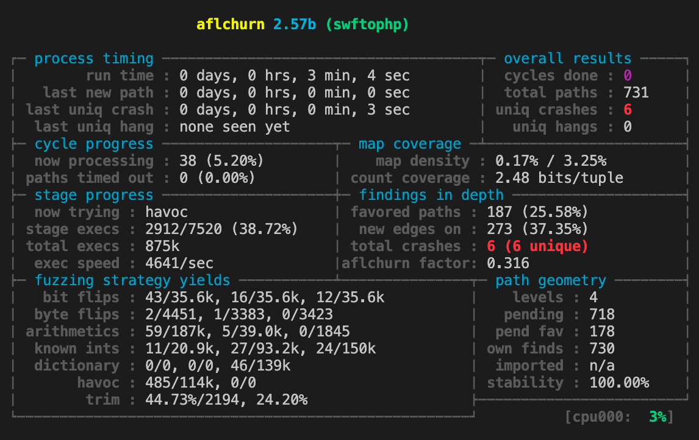

# AFLChurn: What you change is what you fuzz!
This work is accepted by CCS 2021: "Regression Greybox Fuzzing" by [Xiaogang Zhu](https://scholar.google.com.au/citations?user=rav4c-0AAAAJ&hl=en) and [Marcel Böhme](https://mboehme.github.io).

<a href="https://mboehme.github.io/paper/CCS21.pdf"></a>

AFLChurn is a regression greybox fuzzer that focusses on code that is changed more recently or more frequently. In our empirical study on bugs in OSSFuzz, we found that every four in five bugs reported in [OSSFuzz](https://github.com/google/oss-fuzz) are introduced by recent changes, so called regressions. Unlike a directed fuzzer, AFLChurn is not directed towards a single recent commit. Instead, it uses the entire commit history of a project to steer the fuzzing efforts towards code regions where such regressions may lurk. For AFLChurn, ever basic block (BB) is a target. However, some BBs have more and others less weight. Specifically, executed BBs that are changed more recently or more frequently will contribute a greater weight towards the power schedule of AFLChurn.

```bibtex
@inproceedings{aflchurn,
 author = {Zhu, Xiaogang and B{\"o}hme, Marcel}, 
 title = {Regression Greybox Fuzzing},
 booktitle = {Proceedings of the 28th ACM Conference on Computer and Communications Security},
 series = {CCS},
 year = {2021},
 numpages = {12},
}
```

## Project
AFLChurn is developed based on [American Fuzzy Lop (AFL)](https://github.com/google/AFL) which was originally developed by Michal Zalewski <lcamtuf@google.com>. AFLChurn utilizes [git](https://git-scm.com/) to determine how frequently or how recently a BB was changed and an LLVM instrumentation pass to make the compiled program binary efficiently compute the commit-history-based fitness of an executed input.

We tested the code on Linux 18.04, 64-bit system and used git version 2.17.1.

## Build AFLChurn
To build AFLChurn, execute
```bash
git clone https://github.com/aflchurn/aflchurn.git
cd aflchurn
export AFLCHURN=$PWD
make clean all
cd llvm_mode
make clean all
```

## Instrument your Program

When cloning your program, **please retain the entire commit history** (i.e., do **not** use `git clone --depth 1 ..`). Currently, we only support `git`.

Build your project with $AFLCHURN/afl-clang-fast for C code and $AFLCHURN/afl-clang-fast++ for C++ code. For instance,
```bash
CC=$AFLCHURN/afl-clang-fast CXX=$AFLCHURN/afl-clang-fast++ ./configure [...options...]
make
```

## Run AFLChurn on your Program

```bash
afl-fuzz -i <input_dir> -o <out_dir> -- <file_path> [...parameters...]
```

You should see something like this:

The "aflchurn factor" is the fitness of the current seed as decided by the AFLChurn power schedule.

## Configuring AFLChurn
### Fuzzer Options

| Options | args | description | note |
| :---: | :--- | :-------------------------- | :------ |
| `-p` | `anneal` | annealing-based power schedule | default |
| `-p` | `none` | vanilla AFL power schedule | / |
| `-e` | no args | disable ant colony optimisation for byte selection | / |
| `-s` | integer | scale_exponent for power schedule | / |
| `-H` | float | fitness_exponent for power schedule | / |
| `-A` | no args | "increase/decrease" mode for ACO | / |
| `-Z` | no args | alias method for seed selection | experimental |

e.g.,
If `-e` is set, it will not use the ant colony optimization for mutation.

### Environment Variables for our LLVM Instrumentation Pass

| Envs | values | description | note |
| :-------------------- | :--- | :--- | :---- |
| `AFLCHURN_DISABLE_AGE` |   `1`   | disable rdays | / |
| `AFLCHURN_ENABLE_RANK` | `rrank` | enable rrank and disable rdays | / |
| `AFLCHURN_DISABLE_CHURN` | `1` | disable #changes | / |
| `AFLCHURN_INST_RATIO` | integer | select N% BBs to be inserted churn/age | / |
| `AFLCHURN_SINCE_MONTHS` | integer | recording age/churn in recent N months | / |
| `AFLCHURN_CHURN_SIG` | `change` | amplify function x | experimental |
| `AFLCHURN_CHURN_SIG` |`change2`| amplify function x^2 | experimental |

e.g., `export AFLCHURN_SINCE_MONTHS=6` indicates recording changes in the recent 6 months.


# Data and Evaluation
You can reproduce our evaluation without any setup directly on Kaggle:
* https://www.kaggle.com/marcelbhme/ccs21-ossfuzz
* https://www.kaggle.com/marcelbhme/ccs21-figure8
* https://www.kaggle.com/marcelbhme/ccs21-empirical

You can open the notebooks on Github
* https://github.com/aflchurn/aflchurn/blob/main/notebooks/aflchurn.ossfuzz.ipynb
* https://github.com/aflchurn/aflchurn/blob/main/notebooks/aflchurn.agechurn.ipynb
* https://github.com/aflchurn/aflchurn/blob/main/notebooks/aflchurn.empirical.ipynb

You can also run the Jupyter Notebooks yourself.
* Clone this repository: `git clone https://github.com/aflchurn/aflchurn`
* Install [R](https://cran.r-project.org/bin/windows/base/) and [Anaconda Navigator](https://docs.anaconda.com/anaconda/install/) community version.
* Open Anaconda Navigator and create a new R environment through ‘Environments’ tab.
* Return back to ‘Home’ and select the created R environment from the drop-down menu under ‘Applications on’.
* Launch Jupyter and navigate to the the cloned repository. 
* Edit and run our workbooks in the folder in the folder `aflchurn/notebooks`.

# Another version
A more precise way to calculate age/#change can be found in https://github.com/RosenZhu/AFLChurn, which will be integrated into this repository in the future.
